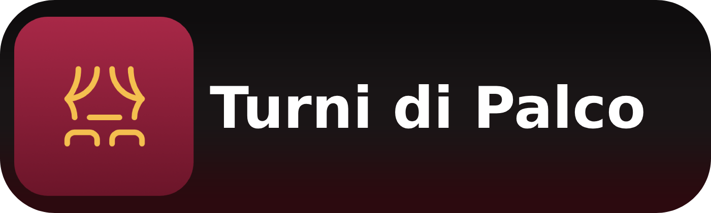

# Turni di Palco
[](https://github.com/Heartran/Turni-di-Palco/actions/workflows/mobile-build.yml)
[](https://github.com/Heartran/Turni-di-Palco/actions/workflows/cleanup-events.yml)
[](https://github.com/Heartran/Turni-di-Palco/actions/workflows/ci.yml)
[](https://github.com/Heartran/Turni-di-Palco/actions/workflows/update-server-repository.yml)
[](https://github.com/Heartran/Turni-di-Palco/actions/workflows/sync-deploy-branches.yml)

Turni di Palco è un progetto che unisce spettacolo dal vivo e gioco digitale.
L’obiettivo è semplice: vivere il teatro in modo più attivo, scoprendo non solo la scena ma anche tutto il lavoro dietro le quinte.




## Cos'è

Turni di Palco è una app in cui l’utente costruisce una carriera teatrale virtuale.
La progressione non dipende solo dal gioco: cresce davvero quando si partecipa agli eventi reali del circuito.

## A chi serve

- Giovani e studenti che vogliono avvicinarsi al teatro in modo coinvolgente.
- Spettatori e appassionati che vogliono capire meglio i mestieri dello spettacolo.
- Scuole e operatori culturali che cercano uno strumento educativo pratico e moderno.

## Perché è utile

- Incentiva la partecipazione reale agli spettacoli.
- Valorizza professioni spesso poco visibili (luci, suono, palco, organizzazione).
- Trasforma l’esperienza teatrale in un percorso di crescita personale.
- Favorisce continuità: non è un evento isolato, ma un percorso nel tempo.

## Come funziona in breve

1. Crei un profilo scegliendo un ruolo teatrale.
2. Completi attività rapide e sfide narrative.
3. Registri la presenza agli eventi tramite QR code.
4. Guadagni esperienza, reputazione e nuovi traguardi.

<a href="https://turni-di-palco-fq85.onrender.com/mobile"></a>

## Struttura del repository

- `apps/pwa`: applicazione web principale.
- `apps/mobile`: interfaccia mobile.
- `shared`: risorse condivise tra moduli.
- `docs/`: materiali di progetto e design.

## Avvio rapido (sviluppo)

Prerequisiti:

- Node.js 18+ (setup corrente: 22.14.0)
- npm

Installazione:

```bash
npm install
```

Comandi principali:

```bash
npm run dev:pwa
npm run build:pwa
npm run test:pwa
```

## Contributi

Per linee guida di collaborazione e convenzioni di sviluppo, vedi `contributing.md`.
