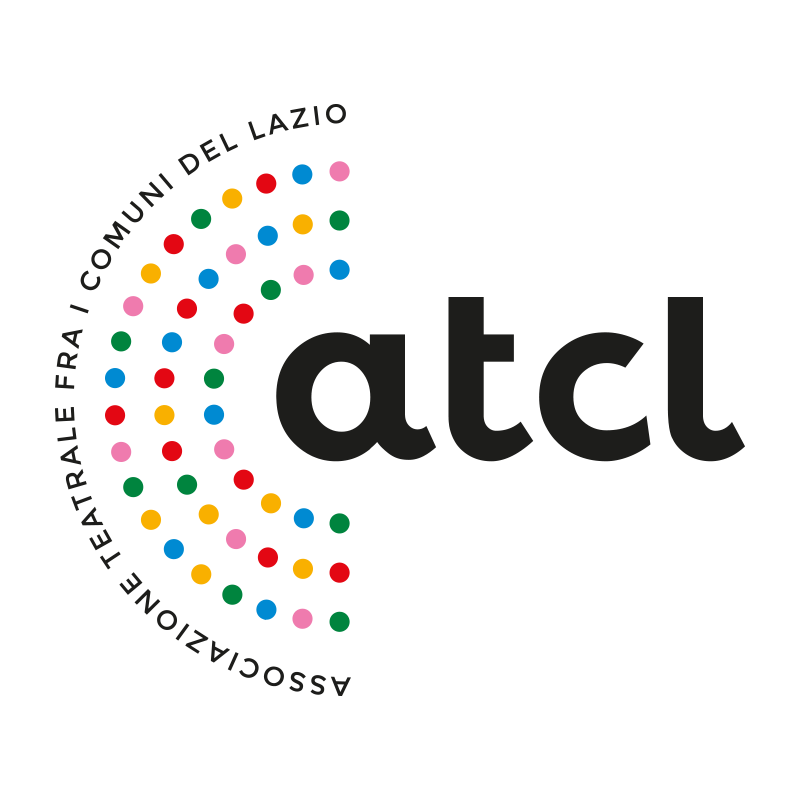

## Che cos'è

**Turni di Palco** è un'applicazione web sviluppata da [A.T.C.L.](https://atcllazio.it) — Associazione Teatrale fra i Comuni del Lazio — che trasforma la partecipazione al teatro in un'esperienza di crescita personale e culturale.

Attraverso un sistema di progressione digitale, ogni spettatore diventa protagonista: costruisce una carriera teatrale virtuale che prende vita solo frequentando gli eventi reali del circuito.

## A chi è rivolto

- **Giovani e studenti** che vogliono avvicinarsi al mondo dello spettacolo in modo coinvolgente e accessibile.
- **Spettatori e appassionati** che desiderano approfondire i mestieri del teatro — dalla regia alle luci, dal suono all'organizzazione.
- **Scuole e operatori culturali** alla ricerca di uno strumento educativo moderno per incentivare la partecipazione agli eventi dal vivo.

## Come funziona

1. **Scegli un ruolo** — al primo accesso selezioni una figura professionale del mondo teatrale che orienterà il tuo percorso.
2. **Partecipa agli eventi** — registra la tua presenza agli spettacoli tramite QR code all'ingresso.
3. **Completa le attività** — sfide narrative e attività rapide legate ai contenuti degli spettacoli.
4. **Costruisci la tua carriera** — accumula esperienza, reputazione e traguardi nel tempo.

## Perché è utile

Turni di Palco nasce dall'esigenza di rendere il teatro un'esperienza continuativa, non episodica. L'applicazione:

- incentiva la partecipazione regolare agli spettacoli del circuito;
- valorizza professioni spesso poco visibili al grande pubblico;
- trasforma ogni visita a teatro in un passo concreto di un percorso personale;
- favorisce il legame tra il pubblico e le realtà teatrali del territorio.

## Screenshot

  
  
  
  

Documentazione tecnica per il team di sviluppo: [DEVELOPMENT.md](DEVELOPMENT.md)

## Licenza

Copyright © 2025 A.T.C.L. — Associazione Teatrale fra i Comuni del Lazio.

Tutti i diritti riservati. Il progetto è proprietario e riservato ad A.T.C.L.
Consulta il file [LICENSE](LICENSE) per il testo completo della licenza.
